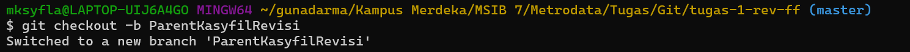
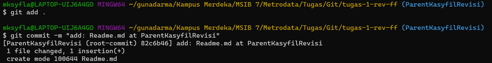
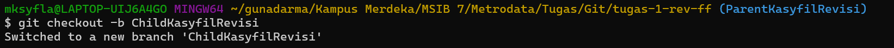

## Hello SIBKM Java Batch 7 🔥

Semangat... 

pasti tetap semangat...

### belajar three way merge - main

### belajar three way merge - develop

---

# Git Merge Fast Forward

1. menginisialisasikan git

2. menambahakan git remote

3. memindahkan branch ke branch ParentKasyfilRevisi

4. melakukan commit pada branch ParentKasyfilRevisi

5. memindahkan branch ke branch ChildKasyfilRevisi

6. melakukan commit pada branch ChildKasyfilRevisi

7. memindahkan branch ke branch ParentKasyfilRevisi lalu melakukan merging dengan ChildKasyfilRevisi

8. melakukan push branch ParentKasyfilRevisi ke GitHub Repository

9. melakukan push branch ChildKasyfilRevisi ke GitHub Repository

# Git Three Ways Merge
1. melakukan github clone

2. memindahkan directory

3. memindahkan branch ke branch MainKasyfilRevisi

4. melakukan commit pada branch MainKasyfilRevisi

5. memindahkan branch ke branch ChildTWMKasyfilRevisi

6. melakukan commit pada branch ChildTWMKasyfilRevisi

7. memindahkan branch ke branch MainKasyfilRevisi

8. melakukan commit pada branch MainKasyfilRevisi yang menghasilkan conflict

9. melakukan push branch MainKasyfilRevisi ke GitHub Repository

10. melakukan push branch ChildTWMKasyfilRevisi ke GitHub Repository

11. memindahkan branch ke branch ChildTWMKasyfilRevisi

12. melakukan git pull untuk mengambil perubahan file pada MainKasyfilRevisi yang menyebabkan conflict

13. bentuk conflict yang terjadi pada Readme.md

14. melakukan commit pada branch ChildTWMKasyfilRevisi yang telah menyelesaikan conflict

15. melakukan push branch ChildTWMKasyfilRevisi ke GitHub Repository

16. melakukan pull request pada GitHub

