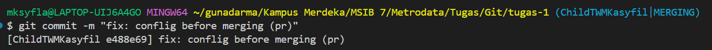

## Hello SIBKM Java Batch 7 🔥

Semangat... 

pasti tetap semangat...

### belajar three way merge - main

### belajar three way merge - develop

[ChildTWMKasyfil] ini seharusnya conflict sama MainKasyfil

[ChildTWMKasyfil] ini seharusnya conflict juga sama MainKasyfil
[MainKasyfil] seharusnya conflict
[MainKasyfil] seharusnya dua conflict
[MainKasyfil] seharusnya tiga conflict

add text in branch MainKasyfil
;

add text in branch ChildTWMKasyfil
;

push branch ChildTWMKasyfil to GitHub

push branch MainKasyfil to GitHub

pull MainKasyfil to ChildTWMKasyfil because of conflict

status of fixing conflict

comitting the conflict

pushing the fix conflict ChildTWMKasyfil to GitHub
